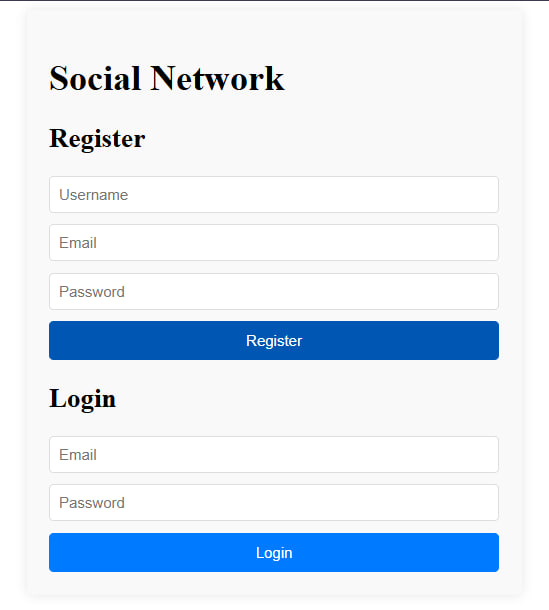
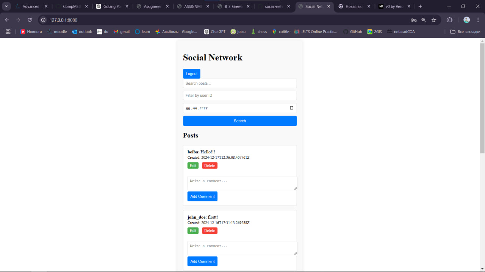
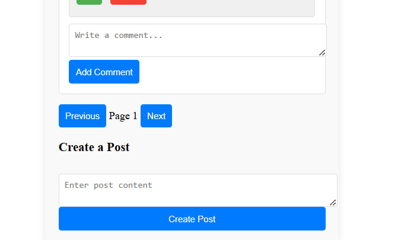

# Social Network Platform

## **Overview**
The Social Network Platform is a web application designed for users to interact by creating posts, commenting on them, and engaging in discussions. This project demonstrates advanced CRUD operations, user authentication, and additional features like search, pagination, and filtering to enhance usability.

## **Features**
1. **User Management:**
   - User registration and login.
   - Ability to edit or delete only your own posts and comments.

2. **Posts and Comments:**
   - Create, read, update, and delete posts and comments.
   - Add comments to posts, including posts by other users.

3. **Advanced Functionality:**
   - **Search Posts:** Find posts containing specific keywords.
   - **Pagination:** Navigate through posts or comments in a paginated manner.
   - **Filtering:** Filter posts by a specific user or date range.

## **Team Members**
- **Beibars Yergali** (Solo Developer)

## **Screenshot**




## **Tools and Technologies**
- **Backend:** Golang (Go)
- **Frontend:** HTML, CSS, JavaScript
- **Database:** PostgreSQL
- **Testing:** Postman

## **How to Start the Project**

### **Prerequisites**
1. Install **Golang**: [Go Download](https://golang.org/dl/)
2. Install **PostgreSQL**: [PostgreSQL Download](https://www.postgresql.org/download/)
3. Install **Postman** for testing: [Postman Download](https://www.postman.com/)

### **Setup Steps**
1. Clone the repository:
   ```bash
   git clone https://github.com/pinokiochan/social-network.git
   cd social-network
### Step 2: Set Up the Database
1. Ensure that PostgreSQL is installed and running on your system. If not, download and install it from PostgreSQL Download.
2. Open your PostgreSQL client (e.g., pgAdmin, psql) and execute the SQL commands in the database.sql file to create the necessary tables:
sql
\i /path/to/database.sql
3. Update the main.go file with your PostgreSQL credentials in the connectToDB function. Example:
connStr := "host=127.0.0.1 port=5432 user=your_username password=your_password dbname=social-network sslmode=disable"
### Step 3: Set Up the Backend
1. Install dependencies:
```bash
go mod init social-network
go mod tidy
```
2. Run the backend server:
```bash
go run cmd/main.go
```
You should see the message: Server is running on port 8080.
### FINAL step
RUN http://127.0.0.1:8080/ in any browser


